# Programming Assignment 06

In this programming assignment, you will use `async-await` syntax and
https://async.rs/[async-std] to complete a
https://en.wikipedia.org/wiki/Rock_paper_scissors[Rock-Paper-Scissors] Game
Server.

You are *strongly* encouraged to read the async-std
https://book.async.rs/tutorial/index.html[Tutorial: Writing a chat].

## Sources and Submission

:duetime: 11:59pm
:dueday: Friday, April 22, 2022

Sources for Programming Assignment&nbsp;06 have been (or will shortly be)
committed to your repository in the `prog06` sub-directory.  If you cloned your
repository before the Programming Assignment&nbsp;06 sources have been
committed, then you will need to _pull_ the upstream changes into your local
clone, by running the command:

  git pull origin

from the `__ritid__psr` directory.  It is best to _pull_ with no uncommitted
changes in your local clone, but most commits made to the upstream repository
will only add a new top-level directory and there should be no merge conflicts.

We will tag programming assignments in the Git repositories at {duetime} on
{dueday}; make sure that you have _committed_ and _pushed_ your final version
before that time.  To do so, run the commands:

  git commit -a
  git push origin main

from the `__ritid__psr` directory.  If old programming assignment comments or
new programming assignment sources have been committed to your repository since
you last pulled, then you will receive an error message when trying to push:

  error: failed to push some refs to 'git.cs.rit.edu:psr2215/<ritid>psr.git'
  hint: Updates were rejected because the remote contains work that you do
  hint: not have locally. This is usually caused by another repository pushing
  hint: to the same ref. You may want to first integrate the remote changes
  hint: (e.g., 'git pull ...') before pushing again.
  hint: See the 'Note about fast-forwards' in 'git push --help' for details.

To proceed, you will need to _pull_ the upstream changes into your local clone
and then _push_ your local changes upstream, by running the commands:

  git pull origin
  git push origin main

from the `__ritid__psr` directory.

## https://en.wikipedia.org/wiki/Rock_paper_scissors[Rock-Paper-Scissors] Game Server

A game server is a good example of the need for and challenges associated with
asynchronous programming.  A game server should:

* handle multiple, concurrent connections from players
* match players for individual games and referee multiple, concurrent games
* maintain consistent information about each player,
  especially when faced with unexpected input and disconnections

The https://en.wikipedia.org/wiki/Rock_paper_scissors[Rock-Paper-Scissors] Game
Server hosts games of
https://en.wikipedia.org/wiki/Rock_paper_scissors[Rock-Paper-Scissors] between
concurrently connected players, while maintaining statistics (wins, losses,
draws, forfeits) for each player.  A new player must choose a password on
initial login, while a returning player must enter their password.  Players may
not have simultaneous logins, but players are automatically logged out on
quitting, disconnecting, or after a (default) 60s timeout at the command loop.
At the command loop, a player may request to change their password, play a game
of https://en.wikipedia.org/wiki/Rock_paper_scissors[Rock-Paper-Scissors], list
the online players, show the overall standings, show their game statistics, or
quit.

When a player requests to play a game of
https://en.wikipedia.org/wiki/Rock_paper_scissors[Rock-Paper-Scissors], the
server attempts to match them to another player concurrently requesting to play
a game; after a (default) 30s timeout, if no opponent is available, then the
player is returned to the command loop.  When a game is initiated, the player
and opponent are declared to the player and the player must choose a weapon
(rock, paper, or scissors).  After a (default) 10s timeout, if the player has
not successfully chosen a weapon, then the player forfeits the match.  When both
the player and opponent have chosen a weapon (or forfeited), then the outcome of
the match is determined, both the player's and the opponent's statistics are
appropriately updated, and the weapon (or forfeit) of the opponent and the
outcome of the match is reported to the player.

An important aspect of the server is that once a player has requested to play a
game, if an opponent is ready to play a game, then both the player's and the
opponent's statistics must be appropriately (and atomically) updated, even if
either the player or the opponent disconnects during any of the interaction up
to the return to the command prompt.  For example, if a player immediately
disconnects after requesting to play a game, then they will necessarily forfeit.
Similarly, if a player immediately disconnects after successfully choosing a
weapon, then they will win, lose, or draw (depending on the action of the
opponent).  The statistics must be updated atomically, meaning that it must not
be possible to observe that the player's statistics have been updated, but not
the opponent's or vice versa.  A consequence of this atomicity is that the
following invariants must hold: the sum of the wins, draws, losses, and forfeits
of all players in the database must always be even; the sum of the draws must
always be even; the sum of the wins, losses, and forfeits must always be even;
the sum of the wins must always be greater than or equal to the sum of the
losses; and the sum of the losses and forfeits minus the sum of the wins must
always be even.  (It would be convenient if the sum of wins equaled the sum of
the losses and forfeits, but if both players forfeit, then neither is awarded a
win.)

A significant portion of the
https://en.wikipedia.org/wiki/Rock_paper_scissors[Rock-Paper-Scissors] Game
Server has been provided.  The missing functionality is support for the `play`
command.

### State Diagrams

The following state diagrams document the intended behavior of the
https://en.wikipedia.org/wiki/Rock_paper_scissors[Rock-Paper-Scissors] Game
Server.  Note, however, that these state diagrams are from the point of view of
one of the players (i.e., `output` indicates text that is sent to the player,
while `input` indicates text that is received from the player).  The server may
have additional (hidden) states that represent concurrently connected players,
games in progress, and other necessary server state.

The `<on disconnect>` nodes in a subgraph indicate transitions that are taken
whenever the player disconnects while at one of the states of the subgraph.
(Typically, disconnects are detected by an error when attempting to send text to
or receive text from the player.)

Click on a diagram to visit the full-size
https://en.wikipedia.org/wiki/Scalable_Vector_Graphics[SVG image]; as SVG
images, they can be arbitrarily scaled (zoomed).

#### Full State Diagram

[link=./assets/state-diagram.svg]

#### Login Subgraph State Diagram

[link=./assets/login-state-diagram.svg]

#### Command-Loop Subgraph State Diagram

[link=./assets/command-loop-state-diagram.svg]

#### Play Subgraph State Diagram

[link=./assets/play-state-diagram.svg]
image::./assets/play-state-diagram.svg[align=center,100%,auto]

Note that in this state diagram, there is no `<on disconnect>` node.  Rather,
there are explicit `<disconnect>` edges for any node that also has an `output`
and/or `input` edge which could fail.  The explicit `<disconnect>` transitions
for the Play subgraph of the state diagram are necessary to ensure that a player's
forfeit is detected and recorded if they disconnect before successfully choosing
a weapon and to ensure that a player's statistics are always appropriately
updated at the end of the game.

### Command-Line Arguments

The `rps` program uses the https://crates.io/crates/clap[`clap` (`crates.io`)]
library for parsing command line arguments and uses the
https://crates.io/crates/log[`log` (`crates.io`)] and
https://crates.io/crates/env_logger[`env_logger` (`crates.io`)] libraries for
logging.

----
rps 
Rock-Paper-Scissors Game Server

USAGE:
    rps [OPTIONS] [SUBCOMMAND]

OPTIONS:
        --command-timeout <SECS>
            Command (and login and password) timeout [default: 60.00]

    -h, --hostname <HOSTNAME>
            RPS Game Server hostname [default: localhost]

        --help
            Print help information

    -l, --log-level <off|error|warn|info|debug|trace>
            Logging level [default: ERROR]

    -p, --port <PORT>
            RPS Game Server port [default: 8203]

        --play-timeout <SECS>
            Play timeout [default: 30.00]

        --weapon-timeout <SECS>
            Weapon timeout [default: 10.00]

SUBCOMMANDS:
    help    Print this message or the help of the given subcommand(s)
    test    Rock-Paper-Scissors Game Server Test
----

### Example

The following are brief transcripts of the server and two clients.

#### Server

----
$ cargo run -q -- -l info
[INFO ] server:: Accepted [::1]:33554
[INFO ] server:client([::1]:33554;matthew):: Command (`stats`)
[INFO ] server:client([::1]:33554;matthew):: Command (`quit`)
[INFO ] server:client([::1]:33554):: Terminated
[INFO ] server:: Accepted [::1]:33556
[INFO ] server:client([::1]:33556;matthew):: Command (`play`)
[INFO ] server:: Accepted [::1]:33558
[INFO ] server:client([::1]:33558;kimberly):: Command (`play`)
[INFO ] server:client([::1]:33556;matthew):: Command (`play`)
[INFO ] server:referee(kimberly vs matthew):: Terminated
[INFO ] server:client([::1]:33556;matthew):: Command (`stats`)
[INFO ] server:client([::1]:33558;kimberly):: Command (`stats`)
[INFO ] server:client([::1]:33558;kimberly):: Command (`play`)
[INFO ] server:client([::1]:33556;matthew):: Command (`play`)
[INFO ] server:referee(kimberly vs matthew):: Terminated
[INFO ] server:client([::1]:33556;matthew):: Command (`stats`)
[INFO ] server:client([::1]:33558;kimberly):: Command (`stats`)
[INFO ] server:client([::1]:33558;kimberly):: Command (`players`)
[INFO ] server:client([::1]:33556;matthew):: Command (`quit`)
[INFO ] server:client([::1]:33556):: Terminated
[INFO ] server:client([::1]:33558;kimberly):: Command (`players`)
[INFO ] server:client([::1]:33558;kimberly):: Command (`quit`)
[INFO ] server:client([::1]:33558):: Terminated
^C
----

#### Client 1

----
$ ncat localhost 8203
Welcome to ROCK-PAPER-SCISSORS!

Enter username [60.00s timeout]:
matthew

Welcome new user!

Enter initial password [60.00s timeout]:
pizza

Enter command {passwd,play,players,standings,stats,quit} [60.00s timeout]:
stats

matthew: wins: 0, draws: 0, losses: 0, forfeits: 0

Enter command {passwd,play,players,standings,stats,quit} [60.00s timeout]:
quit
Goodbye!
[matthew@shadow ~]$ ncat localhost 8203
Welcome to ROCK-PAPER-SCISSORS!

Enter username [60.00s timeout]:
matthew
Enter password [60.00s timeout]:
pasta
Incorrect password
Enter password [60.00s timeout]:
pizza

Enter command {passwd,play,players,standings,stats,quit} [60.00s timeout]:
play

Waiting for opponent [30.00s timeout]...
Sorry, no opponents are ready to battle.

Enter command {passwd,play,players,standings,stats,quit} [60.00s timeout]:
play

Waiting for opponent [30.00s timeout]...
matthew versus kimberly!!
Choose your weapon {r,p,s} [10.00s timeout]:
r
kimberly plays scissors; you win!

Enter command {passwd,play,players,standings,stats,quit} [60.00s timeout]:
stats

matthew: wins: 1, draws: 0, losses: 0, forfeits: 0

Enter command {passwd,play,players,standings,stats,quit} [60.00s timeout]:
play

Waiting for opponent [30.00s timeout]...
matthew versus kimberly!!
Choose your weapon {r,p,s} [10.00s timeout]:
p
kimberly forfeits; you win!

Enter command {passwd,play,players,standings,stats,quit} [60.00s timeout]:
stats

matthew: wins: 2, draws: 0, losses: 0, forfeits: 0

Enter command {passwd,play,players,standings,stats,quit} [60.00s timeout]:
quit
Goodbye!
----

#### Client 2

----
$ ncat localhost 8203
Welcome to ROCK-PAPER-SCISSORS!

Enter username [60.00s timeout]:
kimberly

Welcome new user!

Enter initial password [60.00s timeout]:
kale

Enter command {passwd,play,players,standings,stats,quit} [60.00s timeout]:
play

Waiting for opponent [30.00s timeout]...
kimberly versus matthew!!
Choose your weapon {r,p,s} [10.00s timeout]:
s
matthew plays rock; you lose!

Enter command {passwd,play,players,standings,stats,quit} [60.00s timeout]:
stats

kimberly: wins: 0, draws: 0, losses: 1, forfeits: 0

Enter command {passwd,play,players,standings,stats,quit} [60.00s timeout]:
play

Waiting for opponent [30.00s timeout]...
kimberly versus matthew!!
Choose your weapon {r,p,s} [10.00s timeout]:
Timeout after 10.00s
matthew plays paper; you forfeit!

Enter command {passwd,play,players,standings,stats,quit} [60.00s timeout]:
stats

kimberly: wins: 0, draws: 0, losses: 1, forfeits: 1

Enter command {passwd,play,players,standings,stats,quit} [60.00s timeout]:
players

Online users:
kimberly

Enter command {passwd,play,players,standings,stats,quit} [60.00s timeout]:
players

Online users:
kimberly

Enter command {passwd,play,players,standings,stats,quit} [60.00s timeout]:
quit
Goodbye!
----

## `async fn play_command`

**Complete the `play_command` asynchronous function.**

The `play_command` should implement the Play subgraph of state diagram from
above.  The execution of the `play_command` on behalf of one player must
communicate (either directly or indirectly) with the `play_command` being
executed on behalf of another player.  The major challenge of this assignment is
to correctly orchestrate this communication and properly referee the game of
https://en.wikipedia.org/wiki/Rock_paper_scissors[Rock-Paper-Scissors].

Also, describe the design of the implementation of `play_command`.  Especially
comment on what synchronization primitives are used, how data is communicated or
shared between tasks, and any additional tasks that are spawned.

[source,rust]
----
async fn play_command(
    uname: &str,
    peer_connection: &mut PeerConnection,
    play_timeout: Duration,
    weapon_timeout: Duration,
    // Your code here; additional arguments as necessary
) -> AsyncResult<()> {
    peer_connection.newline("play").await?;
    peer_connection
        .writeln_str(
            &format!(
                "Waiting for opponent [{:.2}s timeout]...",
                play_timeout.as_secs_f32()
            ),
            "play",
        )
        .await?;
    // Your code here
    ...
}
----

As noted in the code, you can (and should) add additional arguments to the
`play_command` function (and, optionally, to the `command_loop` and
`welcome` functions) as necessary to provide the required behavior.

In addition, you can (and should) write additional functions and add code to the
provided functions (e.g., `server`) as necessary to provide the required
behavior.

### Requirements

The `play_command` asynchronous function must be implemented using only the
https://crates.io/crates/async-std[`async-std`] and
https://crates.io/crates/futures[`futures`] crates, as well as the
https://doc.rust-lang.org/stable/std/index.html[Rust Standard Library].

The `play_command` asynchronous function must match the specification described
by the Play subgraph of state diagram from above, with two additional
requirements.  First, the
https://en.wikipedia.org/wiki/Rock_paper_scissors[Rock-Paper-Scissors] Game
Server must support multiple concurrent games of
https://en.wikipedia.org/wiki/Rock_paper_scissors[Rock-Paper-Scissors]; that is,
if 8 players all request to play a game of
https://en.wikipedia.org/wiki/Rock_paper_scissors[Rock-Paper-Scissors] at
approximately the same time, then 4 games of
https://en.wikipedia.org/wiki/Rock_paper_scissors[Rock-Paper-Scissors] should
proceed concurrently (rather than sequentially, where each game does not start
until the previous game ends).  Second, the statistics of the player and the
opponent must be updated atomically.  These additional requirements are not
captured by the Play subgraph of the state diagram, since the state diagram is
from the point of view of one player.

Rubric:

* 25%: Description of design.
* 10%: Supports multiple, concurrent games.
* 5%: Matches the player with exactly one opponent; a player should not be matched with themselves.
* 10%: Uses a timeout of duration `play_timeout` to match the player with an opponent.
* 5%: Declares the opponent when the player is matched with an opponent.
* 5%: Prompts for and accepts a valid weapon selection; prompts for and loops on an invalid weapon selection.
* 10%: Uses a timeout of duration `weapon_timeout` for weapon selection; on timeout, the player forfeits the game.
* 10%: Communicates the player's weapon (or forfeit) to the opponent or referee.
* 10%: Learns the opponent's weapon (or forfeit) from the opponent or referee; declares the opponent's weapon (or forfeit) and outcome of the game.
* 10%: Updates the player's and opponent's statistics appropriately (and atomically) if player and opponent participate correctly or disconnect unexpectedly.

### Discussion/Hints

#### Useful Modules and Functions

Many synchronization primitives used for parallel/concurrent threads have
asynchronous analogs:

* https://docs.rs/async-std/1.11.0/async_std/channel/index.html[`async_std::channel`]
* https://docs.rs/async-std/1.11.0/async_std/sync/struct.Arc.html[`async_std::sync::Arc`]
* https://docs.rs/async-std/1.11.0/async_std/sync/struct.Barrier.html[`async_std::sync::Barrier`]
* https://docs.rs/async-std/1.11.0/async_std/sync/struct.Condvar.html[`async_std::sync::Condvar`]
* https://docs.rs/async-std/1.11.0/async_std/sync/struct.Mutex.html[`async_std::sync::Mutex`]
* https://docs.rs/async-std/1.11.0/async_std/sync/struct.RwLock.html[`async_std::sync::RwLock`]
* https://docs.rs/futures/0.3.21/futures/channel/mpsc/index.html[`futures::channel::mpsc`]
* https://docs.rs/futures/0.3.21/futures/channel/oneshot/index.html[`futures::channel::oneshot`]

Where a synchronous operation could block (e.g., receiving on a channel or
acquiring a lock), the corresponding asynchronous operation is a `Future` that
returns `Pending` when `poll`-ed, allowing another task to make progress until
the operation is ready.  Note that, just as care must be taken to not hold a
lock across a blocking operation in synchronous code, care must be taken to not
hold a lock across an `.await` in asynchronous code; suspending execution at an
`.await` will not release the lock and resuming execution at an `.await` will
not reacquire the lock.

Other potentially useful functions include:

* https://docs.rs/async-std/1.11.0/async_std/future/fn.timeout.html[`async_std::future::timeout`]
* https://docs.rs/async-std/1.11.0/async_std/task/fn.spawn.html[`async_std::task::spawn`]

You are welcome to investigate other functionality from the
https://crates.io/crates/async-std[`async-std`] and
https://crates.io/crates/futures[`futures`] crates.  The above is a superset of
the functionality used in the reference solution.

#### First-Class Channels

Note that channel sides are first-class values; in particular, the corresponding
`Sender` and `Receiver` types implement the `Send` trait.  This means that a
channel side can be sent into / received from a channel.  In particular, when a
server thread/task must communicate with a number of client threads/tasks, the
following idiom is useful:

* The server holds the receiving side of a _request_ channel, while each
  client holds a (cloned) sending side of the _request_ channel.
* When a client initiates a protocol with the server, it creates a private
  _reply_ channel.  The sending side of the _reply_ channel is sent (along with
  the initial protocol data) to the server via the _request_ channel.  The
  client then receives from _reply_ channel.
* The server receives the sending side of a _reply_ channel (along with the
  initial protocol data) from the _request_ channel.  The server formulates its
  reply and sends it to the appropriate client via the _reply_ channel.

Note that this idiom is "safer" than using a shared _reply_ channel (the server
holding the sending side and each client holding a (cloned) receiving side),
because it may be difficult to ensure that the correct client receives the
message from the server.  (There are ways of doing so with bounded and/or
broadcast channels, but they become increasingly complicated, especially when
the server cannot immediately reply to each request (i.e., when the replies may
not be sent in the same order as the corresponding requests).)

The _reply_ channel idiom is also useful for protocols where the participating
threads/tasks must communicate different types of data.  For example, suppose
that the client must send three different types of data (`ReqA`, `ReqB`, and `ReqC`) to
the server, where the value of type `ReqB` depends on the server's response to the
value of type `ReqA` and the value of type `ReqC` depends on the server's response to
the value of type `ReqB`.  One approach would be to define an
`enum ReqMsg{A(ReqA),B(ReqB),C(ReqC)}` for the request messages and an
`enum RespMsg{A(RespA),B(RespB),C(RespC)}` for the response messages and create
the _request_ channel via `channel<(ReqMsg,Sender<RespMsg>)>::new()`.  However,
this leads to the possibility of protocol error: when the server is expecting a
message of type `ReqB` it must use code like
`match msg {ReqMsg::B(b) => ..., _ => panic!("Unexpected message")}`.

A better approach is to encode the sequence of message types via nested _reply_
channels.  In this approach, the (shared) _request_ channel is created via
`channel::<(ReqA,Sender<(RespA,Sender<(ReqB,Sender<(RespB,Sender<(ReqC,Sender<RespC>)>)>)>)>)>()`.
Each of the inner `Sender<_>` types corresponds to exactly one step in the
communication protocol.  The
https://docs.rs/futures/0.3.21/futures/channel/oneshot/index.html[`futures::channel::oneshot`]
channels are especially useful for these _reply_ channels, because they should
be sent to / received from exactly once.

#### Channels Are Queues

Recall that channels naturally impose an order on messages sent into / received
from the channel.  Thus, one design is to have each player register their
interest in playing a game by sending on a channel; anytime that two messages
can be received from the channel within the play timeout, a matched pair of
players has been found.

#### Streams

https://docs.rs/async-std/1.11.0/async_std/stream/index.html[`async_std::stream`]
is an async version of
https://doc.rust-lang.org/std/iter/index.html[`std::iter`].  Thus, the
https://docs.rs/async-std/1.11.0/async_std/stream/trait.Stream.html[`async_std::stream::Stream`]
trait is the analog of the
https://doc.rust-lang.org/std/iter/trait.Iterator.html[`std::iter::Iterator`]
trait.  Like
https://doc.rust-lang.org/std/iter/trait.Iterator.html[`std::iter::Iterator`],
https://docs.rs/async-std/1.11.0/async_std/stream/trait.Stream.html[`async_std::stream::Stream`]
has many _consuming adaptors_ and _stream adaptors_.  The receiving side of a
channel and the lines of a buffered `Read` instance implement the
https://docs.rs/async-std/1.11.0/async_std/stream/trait.Stream.html[`async_std::stream::Stream`]
trait.  Like
https://doc.rust-lang.org/std/iter/trait.Iterator.html[`std::iter::Iterator`],
https://docs.rs/async-std/1.11.0/async_std/stream/trait.Stream.html[`async_std::stream::Stream`]
has a
https://docs.rs/async-std/1.11.0/async_std/stream/trait.Stream.html#method.next[`next()`]
method, but whereas
https://doc.rust-lang.org/std/iter/trait.Iterator.html[`std::iter::Iterator::next`]
returns `Option<Iterator::Item>`,
https://docs.rs/async-std/1.11.0/async_std/stream/trait.Stream.html#method.next[`async_std::stream::Stream::next()`]
returns `impl Future<Output=Option<Stream::Item>>`.

#### Reference Solution

The entire link:./rps/src/lib.rs[`./rps/src/lib.rs`] file of the reference
solution is 1090 lines (when formatted with `cargo fmt`); that is, the reference
solution adds 234 lines (including 47 lines of description) to the provided
link:./rps/src/lib.rs[`./rps/src/lib.rs`] file.

## Testing

Testing of asynchronous (and, therefore, nondeterministic) programs is
difficult.

### `test`

The provided `test` subcommand simulates a number of concurrent players
interacting with the server and monitors input and output for conformance with
the specification.

----
$ cargo run -q -- test --help
rps-test 
Rock-Paper-Scissors Game Server Test

USAGE:
    rps test [OPTIONS]

OPTIONS:
    -B, --bad-frac <FRAC>
            Fraction of bad (misbehaving) players [default: 0.25]

    -C, --check-standings-interval <false|SECS>
            Interval at which to execute check-standings task [default: 0.00]

        --command-timeout <SECS>
            Command (and login and password) timeout [default: 60.00]

    -E, --exclusive-play-interval <false|SECS>
            Interval at which to execute exclusive `play` command [default: 75.00]

    -h, --hostname <HOSTNAME>
            RPS Game Server hostname [default: localhost]

        --help
            Print help information

    -l, --log-level <off|error|warn|info|debug|trace>
            Logging level [default: ERROR]

    -p, --port <PORT>
            RPS Game Server port [default: 8203]

    -P, --players <N>
            Number of players [default: 200]

        --play-timeout <SECS>
            Play timeout [default: 30.00]

    -S, --spawn-server <BOOL>
            Spawn server as an async task [default: true]

    -t, --testing-time <SECS>
            Testing time (and then initiate shutdown) [default: 300.00]

    -T, --throughput-interval <false|SECS>
            Interval at which to execute throughput task [default: false]

        --timeout-slop <SECS>
            Time to consider an "immediate" response to have timed out [default: 2.00]

        --weapon-timeout <SECS>
            Weapon timeout [default: 10.00]
$ cargo run -q -- test
test:shutdown:: Initiating shutdown (an unmatched `play` command may require 30.00s to timeout)
test:shutdown:: Finished shutdown
$ cargo run -q -- test -t 60 -P 1000 -B 0.0 -E false -C false -T 5
test:throughput:: 2118.12 games/sec
test:throughput:: 2157.11 games/sec
test:throughput:: 2182.82 games/sec
test:throughput:: 2196.98 games/sec
test:throughput:: 2203.35 games/sec
test:throughput:: 2207.73 games/sec
test:throughput:: 2211.28 games/sec
test:throughput:: 2209.83 games/sec
test:throughput:: 2214.07 games/sec
test:throughput:: 2218.04 games/sec
test:throughput:: 2219.69 games/sec
test:shutdown:: Initiating shutdown (an unmatched `play` command may require 30.00s to timeout)
test:throughput:: 2220.72 games/sec
test:shutdown:: Finished shutdown
----

Consider the following invocation:

----
$ cargo run -q -- -t 300 -P 200 -B 0.25 -E 75 -C 0 -T 5
----

This will run the server test for 300 seconds before initiating shutdown. A
total of 200 players will be spawned and connect to the RPS Game Server (at the
default hostname `localhost` and port `8203`).  Each of these players will, in
an loop, issue the `play` command, engage in a game of
https://en.wikipedia.org/wiki/Rock_paper_scissors[Rock-Paper-Scissors], issue
the `stats` command, and compare the received stats with the expected stats.  An
additional exclusive player task will, every 75 seconds, initiate an "exclusive"
`play` (that is, it will intruct all other players to pause `play`-ing, wait
until all other players have paused, issue the `play` command and expect the RPS
Game Server to respond with `Sorry, no opponents are ready to battle.` after 30
seconds, and then instruct all other players to resume `play`-ing).  25% of the
players will be bad (misbehaving) players; a bad player may terminate the
connection at any time after issuing the `play` command, may timeout choosing a
weapon, or may choose an invalid weapon.  An additional checker player task
will, every 0 seconds (i.e., in a tight loop), issue the `standings` command and
check that the expected invariants hold.  A throughput task will, every 5
seconds, display the number of (successfully played games by good players).

With a conforming `rps` program, the `test` subcommand should have no output
other than the
``test:shutdown:: Initiating shutdown (an unmatched \`play` command may require <PLAY-TIMEOUT>s to timeout)``
and `test:shutdown:: Finished shutdown`
and (optionally) `test:throughput:: <GpS> games/sec` messages.

While being tested with log level `warn`, the `test` subcommand will have
`[WARN ] server:client([::1]:<PORT>):: Terminated with error (disconnected while <reading|writing> during <PHASE> phase)`
messages; these are expected warnings, due to bad players terminating the
connection during the `play` command.

While being tested with log level `warn`, if the the number of players is increased beyond user and/or operating-system limits, then
the `test` subcommand may have
`[ERROR] server:: Terminated with error (Too many open files (os error <ERR>))`,
`[WARN ] test:player<N>:: Terminated with error (Too many open files (os error <ERR>))`,
`[WARN ] test:player<N>:: Terminated with error (could not resolve address "<HOSTNAME>:<PORT>")`, and/or,
`[WARN ] test:player<N>:: Terminated with error (Connection refused (os error <ERR>))` messages;
the number of players should be decreased.

The following is a suggested sequence for using the `test` subcommand:

* `-t 30 -P 2 -B 0 -E false -C false`
+
--
These arguments test the server with exactly two good players and without
checking the invariants of the `standings` command.  Use these arguments to
ensure that the RPS server is correctly interpreting inputs and responding with
the correct outputs.
--
* `-t 30 -P 2 -B 0 -E false -C 0`
+
--
Now check that the invariants of the `standings` command hold.
An `[ERROR] test:check_standings:: Terminated with error (inconsistent standings (`<INVARIANT>` failed))` message
typically means that the stats of the two players were not atomically updated at
the end of the game, meaning that the checker task was able to observe the stats
of one player having been updated without also observing the stats of the other
player having been updated.  (Hint: The provided
`Database::stats_inc_by_outcome` isn't sufficient to atomically update the stats
of two players at the end of a game.  Instead, one must hold the database lock
while the stats of both players are updated.)
--
* `-t 90 -P 200 -B 0 -E false -C 0 -T 5`
+
--
Now check that the server is able to scale to a larger number of players.  500
games/sec is respectable; with `cargo run -q --debug`, the reference solution
gets between 2100 games/sec and 3700 games/sec (depending on hardware and
operating system), and, with `cargo run -q --release`, gets between 6700
games/sec and 17900 games/sec.
--
* `-t 90 -P 2 -B 0 -E 10 -C 0`
+
--
Now check that server correctly implements a timeout of duration `play_timeout`
to match players.  (When a player requests to play a game of
https://en.wikipedia.org/wiki/Rock_paper_scissors[Rock-Paper-Scissors], the
server attempts to match them to another player concurrently requesting to play
a game; after a timeout of duration `play_timeout`, if no opponent is available,
then the player is returned to the command loop.)
--
* `-t 30 -P 2 -B 0.5 -E false -C 0`
+
--
Now check that server correctly handles a misbehaving player.  Because there are
many ways for a player to misbehave, there are many possible ways for the tester
and/or the server to fail.  Here are some hints:

** ``[ERROR] test:player<N>:: Terminated with error (expected \`Choose your weapon {r,p,s} [<wtimeout>s timeout]:` during play phase, but got \`Choose your weapon {r,p,s} [10.00s timeout]:`; <wtimeout>s < 9.62s failed)``
+
The player paused before giving an incorrect weapon choice; the expectation is
that the timeout has decreased when being prompted again.
** ``[ERROR] test:player<N>:: Terminated with error (expected \`Timeout after <wtimeout>s` during weapon phase, but timeout after <wtimeout + 2>s)``
+
The player forfeits by not choosing a weapon, but the server did not implement a weapon timeout.
** ``[player<N>] Error (expected \`{empty}` during login phase, but got \`User player<N> already online`)``
+
The player disconnected, waited an appropriate amount of time, connected and attempted to login, but the server did not implement the correct timeout (and did not recognize that the player's connection was terminated and did not logout the player).
--
* `-t 30 -P 10 -B 0.5 -E false -C 0`
* `-t 60 -P 50 -B 0.5 -E false -C 0`
* `-t 90 -P 100 -B 0.5 -E false -C 0`
* `-t 120 -P 200 -B 0.5 -E false -C 0`
+
--
Steadily increase the testing time and the number of misbehaving players in
order to execise all possible ways for the players to misbehave.
--
* `-t 600`
+
--
Can your server hold out for 10 minutes (with the defaults of `-P 200 -B 0.25 -E 75 -C 0`)?
--
* `-t 3600`
+
--
For an hour?
--
* `-t 18000`
+
--
For five hours?!?  (The reference solution does.)
--

## Challenges

The following are neither submission requirements nor extra credit work.  They
are simply opportunities to challenge your understanding of and skills with
Rust.

### Save and Load Database

As currently implemented, the game database is lost when the server is
terminated.  Design an on-disk format for the game database and support
`--save <DBFILE>` and `--load <DBFILE>` command-line arguments.  If
`--load <DBFILE>` is given, then the initial game database should be loaded from
the file when the server starts.  If `--save <DBFILE>` is given, then the game
database should periodically be written to the file.  The game database should
immediately be written to disk when a new user (with initial password) is
created and when a user changes their password.  With a large number of
concurrent clients, it may not be performant to write the game database to disk
after every game, but an inconsistent database should never be written to disk.

### Clean Shutdown

As currently implemented, the game server is terminated by killing the process.
Have the server cleanly shut down in response to Ctrl-C.  To cleanly shut down,
the server should stop accepting new clients, immediately declare the system
shutdown to all players at the command loop and terminate the players'
connections, allow all in progress games to complete (and, when the players
return to the command loop, immediately declare the system shutdown and
terminate the players' connections), save the game database to disk, and exit
the process.

The https://crates.io/crates/signal-hook-async-std[`signal-hook-async-std`]
crate may be useful.
